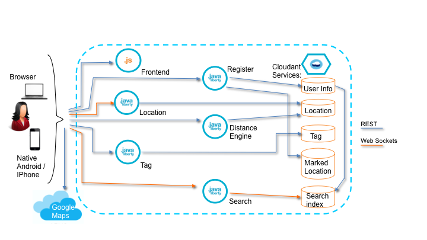

## Overview

BlueTag is a mobile application that aims to connect people based on skills and geolocation. The app can be used at conferences, work places, and meetups to help a user locate people based on common skills and geo-location.  

As a sample, Bluetag showcases how you can build a set of back-end microservices coupled with an HTML5 mobile enabled front-end application. The back-end is comprised of a set of microservices that run on Liberty Java runtimes that interact with the front-end application and a Cloudant database via REST and Web Socket APIs. The frontend is based on HTML5 Web Components and can be deployed as a native application using Apache Cordova or as a web application running on any web server. The application will run in any modern browser on a laptop or mobile device and can also be deployed as a native application running on Android or iOS.

What makes this application a good sample? Bluetag demonstrates many aspects of mobile and web application and highlights how the cloud based services in Bluemix allows you to easily compose your back-end microservices to interact with the front-end. The sample showcases many modern technologies like Cordova and Polymer for mobile development, Java and Node.js runtimes in the cloud, Web sockets, REST services, Microservices, NoSQL databases, location services and many more technologies.  The current sample is the alpha version of our vision for the Bluetag application.

We would love for you to join the project and contribute!

## Live demo

* You can try out Bluetag easily by going to the [live Bluetag demo](http://bluetag.mybluemix.net/?cm_mmc=Display-SampleAppLink-_-BluemixSampleApp-Bluetag-_-Node-Cloudant-_-BM-arshadmu@us.ibm.com).  Enter any name to get started. 

* The map should display with a marker on your current location.  As you move around, the marker and map dynamically adjust to your location.

* You can use the navigation links on the left to do the following:

**Near me:**  Lists users who are within 10 meters of you.  Press TAG and the user will be added to your contacts.

**Contacts:**  These are people that you have either tagged when they were near you, or that you added via Search.  You can click the button to show them on your map.

**Places:**  When you press "Mark it" on the map, the location is added on your places.   You can click the link to show this place on your map.

**Search:**  Start typing and Bluetag dynamically searches for user names that start with what you type.   You can select users to add to your contacts.

**Settings:**  You can prevent location updates from sending updates to the location service and you can toggle logging in the debug console.


## Architecture and implementation details

Below is a high level architecture diagram of the Bluetag application.  For more details of the services, please review the design and implementation detail docs under [bluetag-docs](bluetag-docs).


## Download the Bluetag code

All the code for Bluetag is housed in git repositories.  Let's clone these repositories to your local environment first.  Since Bluetag follows a microservice architecture, all the services have their own github repositories.  All the services are defined as submodules of bluetag.  The --recursive attribute in the git clone command will pull down the code from all the submodules automatically.  From your terminal run the following commands:

  ```
  mkdir myBluetag
  cd myBluetag
  git clone --recursive git@github.ibm.com:Bluetag/bluetag.git
  ```

This will pull in the master bluetag repository and all the submodules that contain the code for the front-end, back-end microservices, and shared code.

## Running the app on Bluemix

* If you have an existing Bluemix account please skip to the next step.  If not you can [sign up](http://www.bluemix.com?cm_mmc=Display-SampleAppLink-_-BluemixSampleApp-Bluetag-_-Node-Cloudant-_-BM-arshadmu@us.ibm.com) a free Bluemix trial.

* Download and install the [Cloud-foundry CLI](https://github.com/cloudfoundry/cli) tool

* Connect to Bluemix in the command line tool and follow the prompts to log in.

  ```
  $ cf api https://api.ng.bluemix.net
  $ cf login
  ```

## Setup database service on Bluemix
  
* Create a Cloudant NoSQL DB service in Bluemix.

  ```
  $ cf create-service cloudantNoSQLDB Shared bluetag-cloudant
  ```

## Deploy backend services to Bluemix
* Let's deploy the backend services to Liberty servers on Bluemix.  Replace the prefix in the host attribute in the manifest.yml file in each of the projects below to give it a globally unique hostname.

   ```
   $ cd ../bluetag-register
   Update <prefix> in manifest.yml
   $ cf push

   $ cd ../bluetag-location
   Update <prefix> in manifest.yml
   $ cf push

   $ cd ../bluetag-engine
   Update <prefix> in manifest.yml
   $ cf push

   $ cd ../bluetag-tag
   Update <prefix> in manifest.yml
   $ cf push
   
   $ cd ../bluetag-search
   Update <prefix> in manifest.yml
   $ cf push
   ```

## Deploy the frontend service to Bluemix
* The Bluetag front-end is hosted on a node.js service.  Next let's deploy the bluetag-frontend node service. 
   
* Update the contents of the env-config.json file under the bluetag-frontend/www/app directory to reflect the back end service URLs that were created in the previous step.
 
* Go into the bluetag-frontend/www directory and edit the `manifest.yml` file and change the `host` attributes to something unique.

  ```
  applications:
  - name: bluetag-frontend
    framework: node
    runtime: node12
    memory: 128M
`    instances: 1
    host: <prefix>-bluetag
  ```
  The host will determine your application url initially, e.g. `<host>.mybluemix.net`.
 
* Push the node application to Bluemix.  

   ```
   $ cf push
   ```
   
Congratulations! You now have a live instance of the Bluetag application running in your Bluemix account!  You can access the application using at http://<prefix>-bluetag.mybluemix.net.

## Setting up a dev environment for the microservices in Eclipse

* In Eclipse, import the cloned projects into your workspace.
	- Goto File > Import and select General > Existing Projects into Workspace.
	- Select the bluetag directory and it will import all the submodules as projects to your workspace.

* Next we need to install a local instance of the Liberty app server to resolve some build dependencies. 
	- In the Server view, right click and select New > Server.
	- Select IBM > WebSphere Application Server Liberty and click Next.
	- In the "Install Runtime Environment" panel, select "Download and install a new runtime environment from ibm.com".
	- Select "Liberty Repository" and "WAS Liberty V8.5.5.x with Java EE Full Platform" in the choices below and click Next.
	- In the next panel, click "New" and create a server with a name like Bluetag and hit Finish.
	- Clean and rebuild all the projects.
	
You should have a workspace that's ready to build the Bluetag back-end services now!

## Building and testing the frontend locally

* The bluetag-frontend project is structured to work with Cordova and is written using HTML5 and javascript.

* To test the code locally from the bluetag-frontend/www directory run the following command to download the gulp node modules.  If you don't have npm installed, you can install it by following the instructions at https://docs.npmjs.com/getting-started/installing-node.  npm will download some gulp modules that have some OS specific prereqs.  Please visit the installation section at https://github.com/nodejs/node-gyp and install the OS specific prereqs before running the npm command below.

   ```
   npm install
   ```
   
* To build and start a webserver to host the application locally run the following command

   ```
   gulp serve
   ```
   
   This should produce output similar to this and list the URL the application can be accessed from:
   ```
	arshadmus-MacBook-Pro:www arshadmu$ gulp serve
	[15:15:09] Using gulpfile ~/Desktop/BT/www/gulpfile.js
	[15:15:09] Starting 'styles'...
	[15:15:10] Starting 'elements'...
	[15:15:10] Finished 'elements' after 20 ms
	[15:15:10] styles all files 98 B
	[15:15:10] Finished 'styles' after 1 s
	[15:15:10] Starting 'serve'...
	[15:15:10] Finished 'serve' after 569 ms
	[PSK] Access URLs:
	 -----------------------------------
		   Local: http://localhost:5000
		External: http://12.34.56.78:5000
	 -----------------------------------
			  UI: http://localhost:3001
	 UI External: http://12.34.56.78:3001
	 -----------------------------------
	[PSK] Serving files from: .tmp
	[PSK] Serving files from: app
	```

You can view the application in your browser using the UI link above and you are now ready to tweak and test the Bluetag frontend code!

## Building a native application

If you want to transform bluetag from a browser based web application to a native mobile application, you can quickly do that without any additional code using Cordova.

To get started, let's get Cordova setup first by running the following command 

   ```
   npm install -g cordova
   ```
   
You can find specific Cordova installation instructions at https://cordova.apache.org/#getstarted

* To create a new Cordova project, you can just run the following command: cordova create <path>

* In this case, you can just cd into myBlueTag/bluetag-frontend to access the Bluetag Cordova project.
   
* Next, we need to get the SDKs to build the application for the platforms we want.  

    TIP: Android SDK will not work with the IBM JDK.  Please make sure the Oracle JDK is your default JDK.

	For Android, you can download them from: https://developer.android.com/sdk/index.html#Other
	After installing in the SDK Manager, make sure to download the SDK for API22 (Android 5.1.1)
	
	For iOS, you can download the SDK from https://developer.apple.com/support/pre-release-software/.  NOTE: This will only work on Macs.  

* (Only for Android) Export the variable ANDROID_HOME with the value of the path of the SDK directory.

	for example: export ANDROID_HOME="/usr/home/Android/android-sdk" on Linux
	
	or setx ANDROID_HOME "C:\Program Files (x86)\Android\android-sdk" on Windows.
	
* Next, tell Cordova about the platforms you will be building on by running:

	```
	cordova platform add <platform name>
	```
	
	Example platform names are android and ios.
	
* Now we are ready to build the application for the platforms we want to deploy the app to! To just build the application without deploying to a physical device or emulator you can run:

	```
	cordova build <platform name>
	```
	
* To build and run the application, you can run:
 	
	```
	cordova run <platform name>
	```
	
	This will deploy to the connected device or start an emulator if no device is found.

	TIP: To be able to deploy and test on an Android device:
		* Plug Android phone into USB port on laptop
        * Enable developer options:
        * Go to Settings -> About phone.  Click 7 times on build number.
		* The Developer Options panel should appear.
		* Select "enable USB debugging".

You are now test out the Bluetag app on your iPhone or Android device!

## Troubleshooting

To troubleshoot your Bluemix app the main useful source of information is the logs. To see them, run:

  ```
  $ cf logs <application-name> --recent
  ```
  
##Privacy Notice

The Bluetag application includes code to track deployments to Bluemix and other Cloud Foundry platforms. The following information is sent to a Deployment Tracker service on each deployment:

    Application Name (application_name)
    Space ID (space_id)
    Application Version (application_version)
    Application URIs (application_uris)

This data is collected from the VCAP_APPLICATION environment variable in IBM Bluemix and other Cloud Foundry platforms. This data is used by IBM to track metrics around deployments of sample applications to IBM Bluemix. Only deployments of sample applications that include code to ping the Deployment Tracker service will be tracked.

##Disabling Deployment Tracking

Deployment tracking can be disabled by removing require("cf-deployment-tracker-client").track(); from the beginning of the server.js file in the bluetag-frontend/www directory.